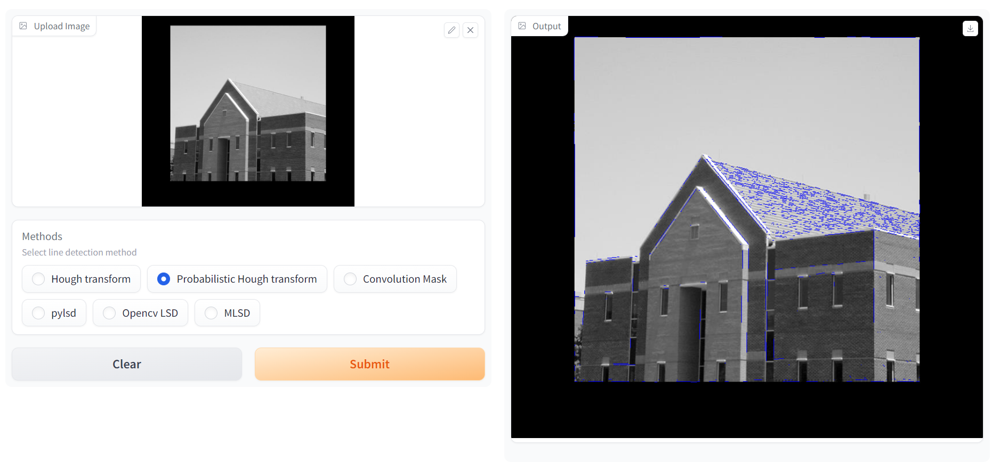
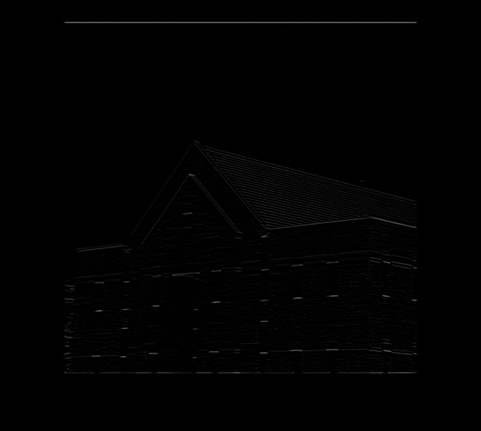
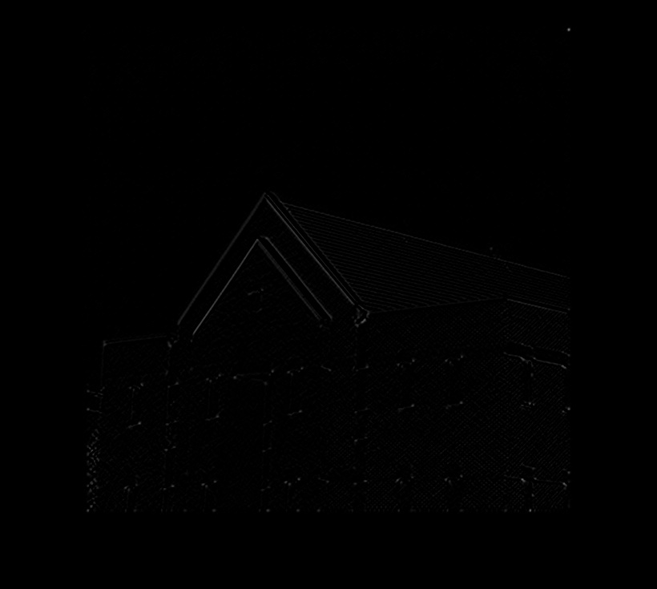
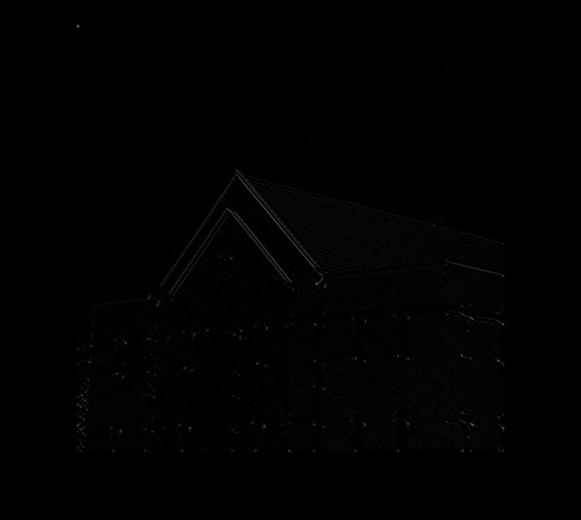
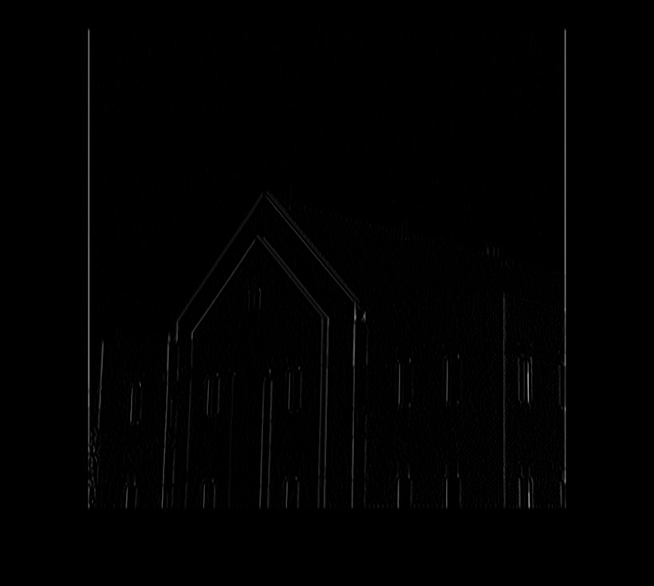
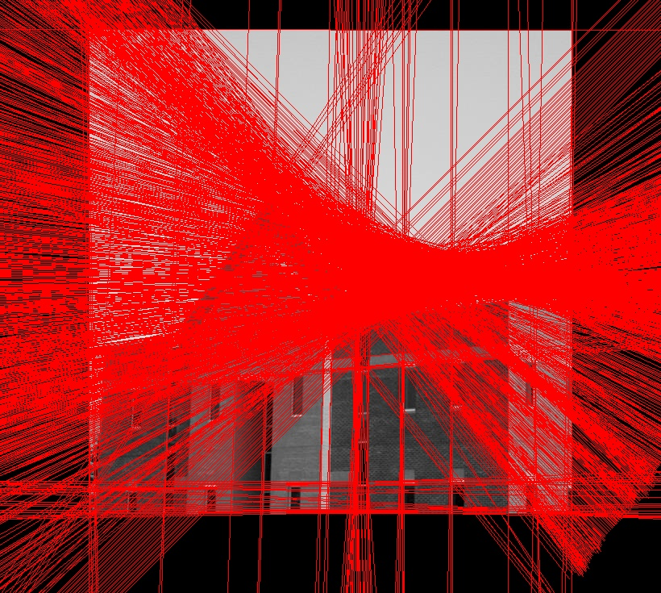
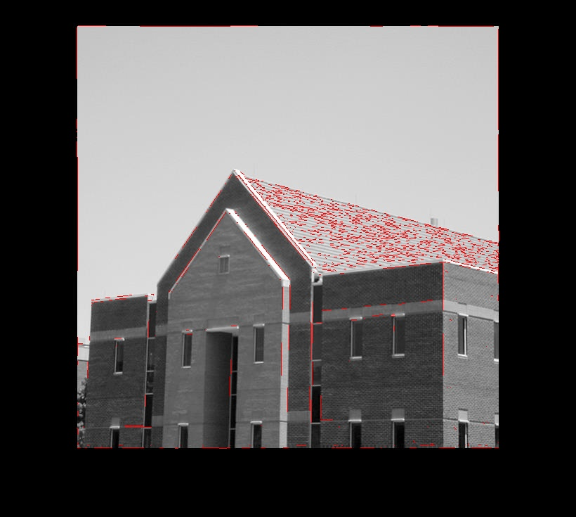
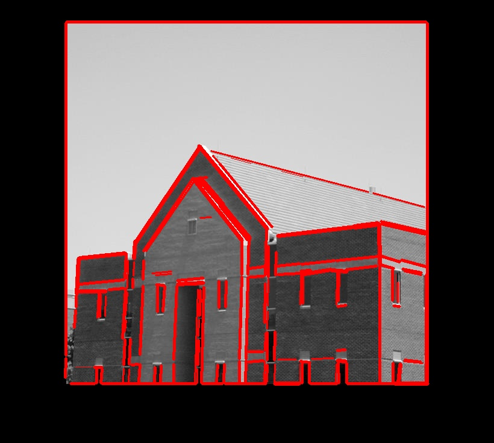
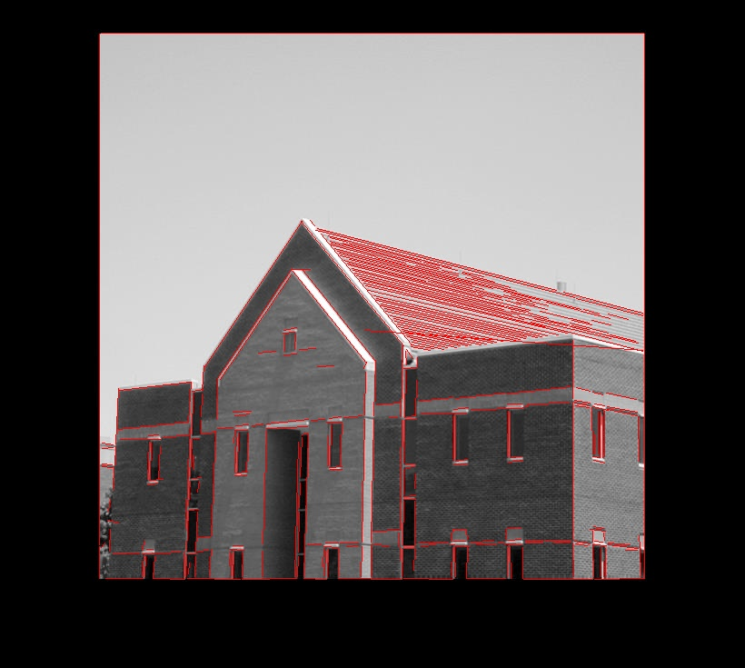
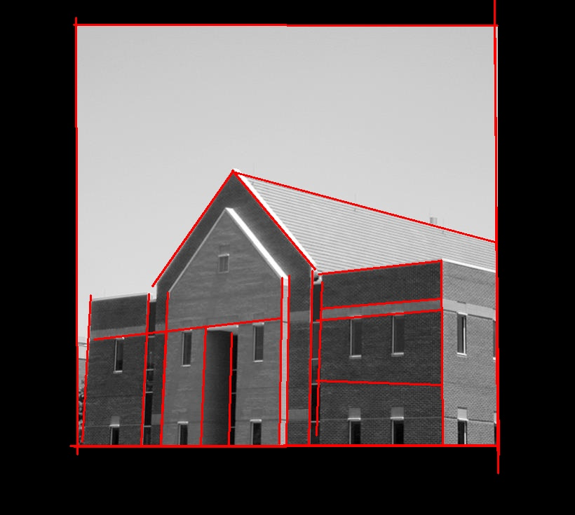

# Line_detection_methods
The line detection is primary task in Computer Vision. There are different approaches to detect line from an image. Here will cover some of those methods with basic implementation.

## Methods:
* Hough transform
* Probabilistic Hough transform
* Convolution Mask
* pylsd
* OpenCV LSD
* MLSD

## Command:
```
! python line_detection.py --image image_name --method method_name
```
For method_name, refer above methods.

```
! python line_detection.py
```
This command will run line detection on sample image using hough transform.



Run the demo.
```
python demo.py
```

## Requirements:
```
!pip install -r requirements.txt
```
For MLSD method, first clone https://github.com/navervision/mlsd.git repository.

## Results:
* Convolution Mask
 
   

* Hough Transform


* Probabilistic Hough Transform


* pylsd


* OpenCV LSD


* MLSD


## Reference:
1. https://github.com/navervision/mlsd
2. https://github.com/AndranikSargsyan/pylsd-nova
3. https://docs.opencv.org/3.4/d9/db0/tutorial_hough_lines.html


